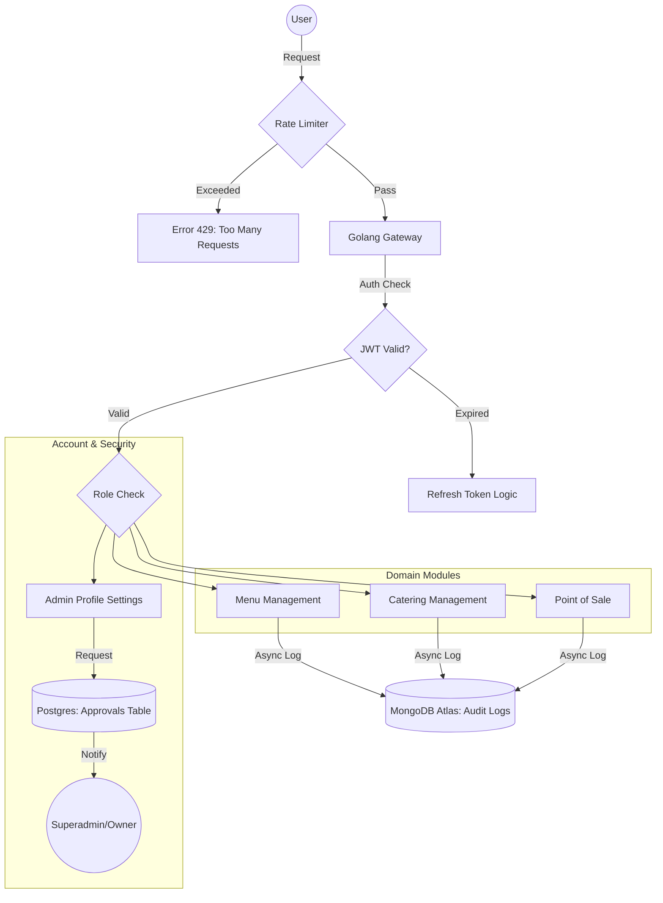
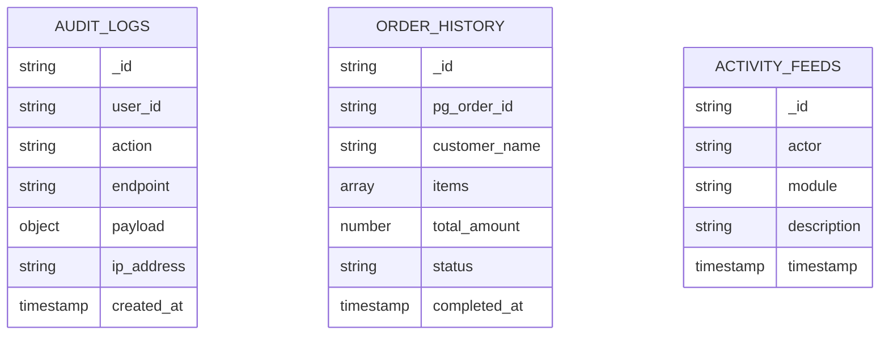
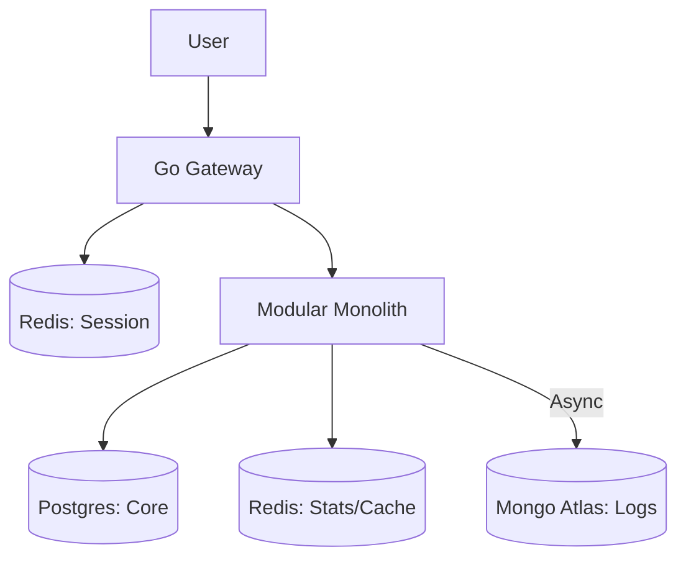
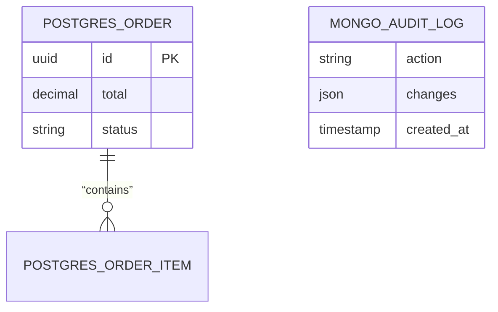

## 1. Project Overview

An integrated system for Catering Management and Point of Sale (POS) running on STB infrastructure (resource-constrained). The system uses a **Modular Monolith** architecture with a **Hybrid Database** strategy:

- **PostgreSQL**: Transactional Data (Orders, Menus, Users).
- **Redis**: Speed Layer (Session, Dashboard Counter, Caching).
- **MongoDB Atlas**: Log Layer (Audit Trail & Activity History).

## 2. Development & Build Commands

### Backend (Go)

- **Run Development**: `cd back-end && go run main.go`
- **Build Binary**: `cd back-end && go build -o ds-app`
- **Tidy Dependencies**: `go mod tidy`
- **Update Swagger**: `swag init` (If using Swagger)

### Frontend (React)

- **Install Dependencies**: `cd front-end && npm install`
- **Run Development**: `npm start`
- **Build Production**: `npm run build`

## 3. Testing Commands

- **Run All Backend Tests**: `cd back-end && go test ./...`
- **Run Specific Package Test**: `go test ./service/implementations/...`
- **Frontend Tests**: `cd front-end && npm test`

## 4. Code Patterns & “Skills”

### Account Approval Workflow

Admin profile updates must not be saved directly to the `users` table. They must be stored in the `approvals` table for Superadmin review.

**Pattern:**

1. Check Redis Key.
2. If found: Return.
3. If not: Retrieve from DB -> Save to Redis (TTL 1 Hour) -> Return.

## 5. Directory Structure

- `back-end/controller/`: API entry point.
- `back-end/models/`: GORM schema definitions (Postgres).
- `back-end/service/`: Pure business logic.
- `front-end/src/components/`: Modular UI components.

## 6. Architecture Diagrams

### Flow Chart

```mermaid
graph TD
    User((User/Cashier)) -->|Request| Gateway[Golang Gateway]
    Gateway -->|Check Session| RedisSession[(Redis: Session & OAuth)]
    
    Gateway -->|Validated| Backend[Backend Modular Monolith]
    
    subgraph “Backend Modules”
        Menu[Menu Module]
        POS[POS Module]
        History[History Module]
    end

    Menu -->|Read/Write| Postgres[(PostgreSQL Local: Master Data)]
    Menu -.->|Cache| RedisMenu[(Redis: Menu Cache)]
    
    POS -->|Transaction| Postgres
    POS -->|Update Counter| RedisStats[(Redis: Dashboard Stats)]
    
    Backend -->|Async Log| History
    History -->|Save Document| MongoAtlas[(MongoDB Atlas: Audit & History)]
```

### Flowchart Superadmin Approval dan Rate Limiting



### ERD



### System Flow



### Data Schema (Hybrid)



## 7. Style Guidelines

- **Naming**: Use `PascalCase` for functions and structs exported in Go.
- **Error Handling**: Never ignore errors. Use `fmt.Errorf` with clear context.
- **Frontend**: Use Tailwind CSS for styling. New components must be placed in `front-end/src/components/`.